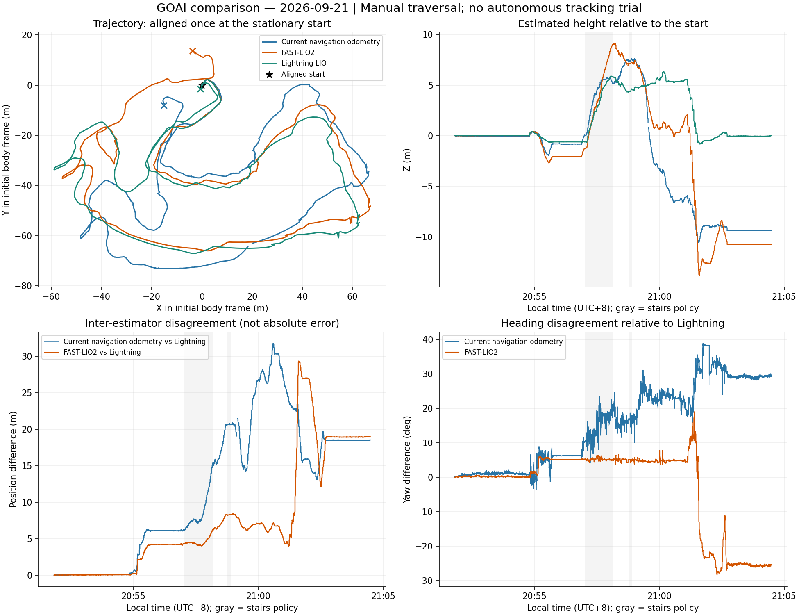
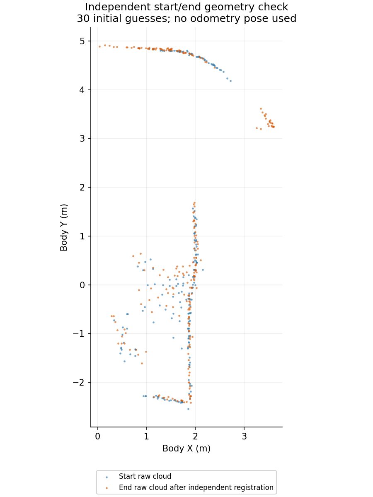

# 本轮导航里程计对比分析

数据：`20260921-205016-live-front-nav-comparison`，2026-09-21 20:50–21:04，北京时间。全部在本机离线分析，未修改机器人服务。

## 结论

**本轮 Lightning LIO 明显优于当前导航里程计和当前参数下的 FAST-LIO2。建议将后续主里程计接入的优先候选调整为 Lightning，保留 FAST-LIO2 做问题回放和调参。** 这与之前依据短回放实时性优先考虑 FAST-LIO2 的判断不同，新的完整运动数据提供了更直接的依据。

当前里程计确实存在严重累计漂移；FAST-LIO2 也发生了明显错误运动估计。Lightning 的闭合结果更好，但仍约有 1.7 米位置偏差，不能认定已经满足所有窄通道、楼梯和 waypoint 的精度要求。

本轮实际运动主要由人工控制完成，**没有有效的自动导航跟踪过程**，因此不能据此评价 PID 超调、自动 waypoint 到达或人工介入后的自动恢复。

## 1. 独立点云验证：两处实际位置接近，漂移来自估计

使用开始和结束的静止原始前雷达点云，只应用固定雷达—本体外参，不使用三套里程计的位姿或运动补偿结果。分别从 30 个平移/航向初值进行 GICP 配准，并用未参与拟合的扫描交叉检查。

- 配准得到结束相对开始的平移约 `[-0.037, +0.085, -0.006] m`，距离约 **0.093 m**，相对航向约 **+4.73°**。
- 拟合扫描的 25 cm 内重叠率约 **90.0%**，最近邻距离中位数 **6.7 cm**；留出的扫描重叠率约 **90.0%**、中位数 **6.5 cm**。
- 这支持“回到了起点附近”的几何判断。它是本地场景配准参照，不是全程测量真值；不能据此给出全程 ATE 精度。

在相同起终点静止窗口比较各算法的相对位姿：

| 里程计 | 相对点云参照的位置偏差（3D） | 高度偏差 | 姿态偏差（3D） |
|---|---:|---:|---:|
| 当前导航里程计 | **19.57 m** | −9.35 m | 24.23° |
| FAST-LIO2 | **17.76 m** | −10.72 m | 31.87° |
| Lightning LIO | **1.71 m** | −0.03 m | 5.48° |

这里的“位置偏差”是终点闭合偏差，不是整条路线的均方误差。三套轨迹绘图只在开始时进行一次刚体对齐，没有用整段轨迹拟合来掩盖漂移。

图中的坐标是共同开始时刻的本体参考系。灰色区域是人工选择楼梯普通策略的时段，不等同于外部确认的地形分段。原里程计相邻测量间隔超过 0.45 秒时，图中留空，避免把长时间插值画成真实观测。

## 2. FAST-LIO2 在 21:01:32 附近发生明显错误运动估计

最明确的异常窗口是 **21:01:31.751–21:01:36.751**，当时为人工基础普通模式：

| 证据 | 同一约 5 秒窗口的结果 |
|---|---|
| 前向摇杆 | 始终为正，归一化值约 0.645–1.0 |
| 机器人速度反馈 | 前向速度始终为正，0.88–1.84 m/s，中位数 1.27 m/s |
| 当前里程计 | 相对窗口开始本体坐标，X 位移约 **+5.27 m** |
| Lightning | X 位移约 **+4.74 m** |
| FAST-LIO2 | X 位移约 **−10.56 m** |

此时包含转向，以上 X 是相对窗口开始朝向的位移分量，不是行程积分。Lightning 和当前里程计的变化与前向速度反馈相符，FAST-LIO2 的估计明显背离。该窗口 FAST-LIO2 与 Lightning 的位置分歧从约 15.2 m 增长至 29.0 m。

此前约 21:01:20 起，FAST-LIO2 已出现额外高度和姿态偏差；异常之后也没有恢复正确闭合。现有日志没有保存滤波器偏置、重力状态、有效约束数量和创新量，尚不能进一步确认是退化几何、IMU 状态估计、点云补偿还是局部地图更新导致。**不能将此故障简单归为通信延迟，也不能认定 FAST-LIO2 算法本身普遍劣于 Lightning。结论仅针对本次接入版本与参数。**

## 3. 当前前端：累计漂移与测量间断同时存在

- 高度估计在运动中逐渐偏离，最终比点云参照低约 9.35 m，终点位置偏差约 19.57 m。只改变“定位正常/失效”的显示或置信度门槛，不能修正这些坐标误差。
- 捕获到的导航日志中，前后雷达主源切换 **142 次**。当前切换等待参数为 0.25 秒，而本轮前雷达输入间隔 P95 接近 0.30 秒；主备切换容易受到正常扫描间断影响，需要检查保持主源和坐标衔接的设计。
- 切换不是全部原因。相对 Lightning 的航向变化中，同源连续配准也存在累计偏差，不能只修切换次数就认为漂移解决。
- `LOST` 累计约 **5.73 秒**，最长连续约 **2.06 秒**；两个主要区间在 20:59:08.833–20:59:10.895、20:59:12.134–20:59:12.983。当时是人工踏步移动。
- `ODOM_BRIDGE` 在本应用里表示按已对齐的连续里程计运行，**不能把它统计为定位丢失**。`PREDICT_ONLY` 累计约 166 秒，反映新雷达校正的连续性仍不足。

特别核对了两次看起来像“姿态突然跳变”的恢复：70.85° 和 97.20°。同一时间段，两套 LIO 和原始陀螺积分均给出相近转动量。因此它们主要是**配准间断后补上了真实转动**，不应误判为凭空翻转，也不应据此新增限制大角度运动的规则。

## 4. 人工指令链路正常；自动导航尚未被本轮验证

- 5,794 条人工速度指令均可按运行 ID 和序号与发送记录关联，**5,794 / 5,794 的 X、Y、Yaw 数值一致**，没有发现软件转发时改写符号或轴序。
- 来源状态到发送记录的延迟中位数约 **73.5 ms**、P95 **118.1 ms**；不是从 G12 按键动作到电机响应的端到端延迟。
- 自动模式仅在 20:54:39.883–20:54:40.733 出现，处于 `WAIT_POLICY_FEEDBACK`。关联到自动模式的 13 条发送记录全部为零。
- 随后操作以人工控制为主，目标点保持 B01。因此本轮不能用于判定上楼自动指令方向、PID 超调、B05/B06 横向校正、人工介入后继续导航是否修复。

人工指令数值正确不等于每一帧实际速度都完全跟随；本轮结论是控制转发链路没有出现方向改写，且上述 FAST-LIO2 异常窗口有独立机器人反馈支持。

## 5. 输入与日志：IMU 连续，但点云接收和记录需要改进

**IMU：** 两套算法都收到 170,327 条 IMU。时间间隔中位数约 5.00 ms，最大约 10.55 ms，无非有限值和时间倒退。运动中加速度模长峰值约 63.55 m/s²（约 6.5 g），说明存在较强冲击；需要在状态估计中处理动态加速度和偏置，不能据此简单拒绝整段 IMU。

**算法输出：** 两套算法都收到 6,660 帧点云；FAST-LIO2 输出 6,657 帧，Lightning 输出 6,659 帧。按原始扫描时间区间重新关联后，输出一对一，无重复关联，预热后没有额外缺失输出。

旧摘要中的“两套各缺失 6 帧”是关联统计误报。逐点筛选使最终保留点的时间提前约 10.6–17.1 ms，超出了旧的 ±10 ms 扫描末点匹配窗口。6 个输出均可唯一对应原始扫描区间；其中原始 bag 保存到的 3 帧还直接复现了筛点后的末点时刻。其余 3 帧的原始点云未被独立录制器收到。

**延迟与间断：** FAST-LIO2 延迟 P95 约 66.7 ms、峰值 894 ms；Lightning P95 约 69.6 ms、峰值 911 ms。这里是输入回调到输出观测的延迟。实际输出到达间隔最大分别约 1.27 s / 1.24 s；前雷达输入自身的最大时间戳间隔约 0.80 s。这些间断需要处理，但不足以解释 FAST-LIO2 上述反向位移和十余米累计偏差。

**记录链路：** 同一原始时间范围，验证适配器收到 6,059 帧前雷达，独立录制器保存 5,144 帧，二者共同收到 4,128 帧。适配器独有 1,931 帧，录制器独有 1,016 帧。说明独立订阅的接收集合不同；不能把所有缺帧都归因传感器，也不能声称 bag 完全复现了在线算法的全部输入。

文件同步校验仍然完整：问题发生在采集期间各订阅者的接收，不是本机拷贝丢失。下一版应从同一适配入口分发给算法和记录器，并记录扫描 ID、原始时间戳及实际消费情况。

## 建议实施顺序

1. **优先接入 Lightning 的连续里程计与 IMU 预测**，保留操作者重定位对齐、原有路线与人工接管，不增加置信度暂停或速度限制。仍须验证楼梯局部误差和运动过程中恢复能力。
2. **修正同源记录和扫描关联统计**，补齐滤波状态、IMU 偏置、重力、有效几何约束、处理耗时及队列延迟日志。
3. **用同一份已录制输入回放两套 LIO**，重点观察 21:01:20–21:01:40，分析 FAST-LIO2 的失配和错误位移。该回放能做公平的同输入对比，但由于原始录制缺少部分在线帧，不能称为逐帧完全复现在线历史。
4. **再进行实际自动导航与接管后恢复测试**。本轮无法给出这部分通过结论。

## 可复查证据

- [三路轨迹与时序摘要](initial_analysis.json)
- [闭合、异常窗口与定位间断分析](detailed_analysis.json)
- [独立点云闭合配准](closure_registration.json)
- [指令转发与雷达切换统计](control_and_source_audit.json)
- [扫描关联、IMU 与实际反馈复核](final_audits.json)
- [原始 bag 逐话题解析数量](mcap_counts.json)
- [轨迹图 PDF](trajectory_comparison.pdf)

分析采用单次初始刚体对齐；设备时间到 Orin 单调时间使用 IMU 到达时刻的低分位映射，仍有小幅同步不确定性。终点比较选用静止窗口，降低这项误差的影响。上述结果没有外部全程测量真值，Lightning 也没有被当作全程真值使用。
