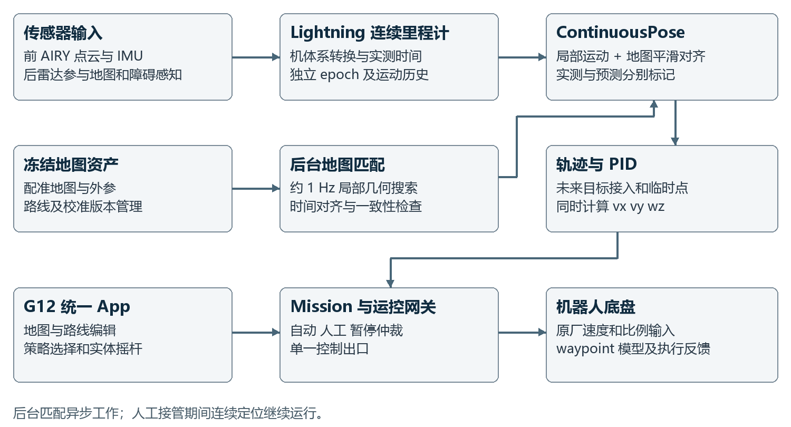
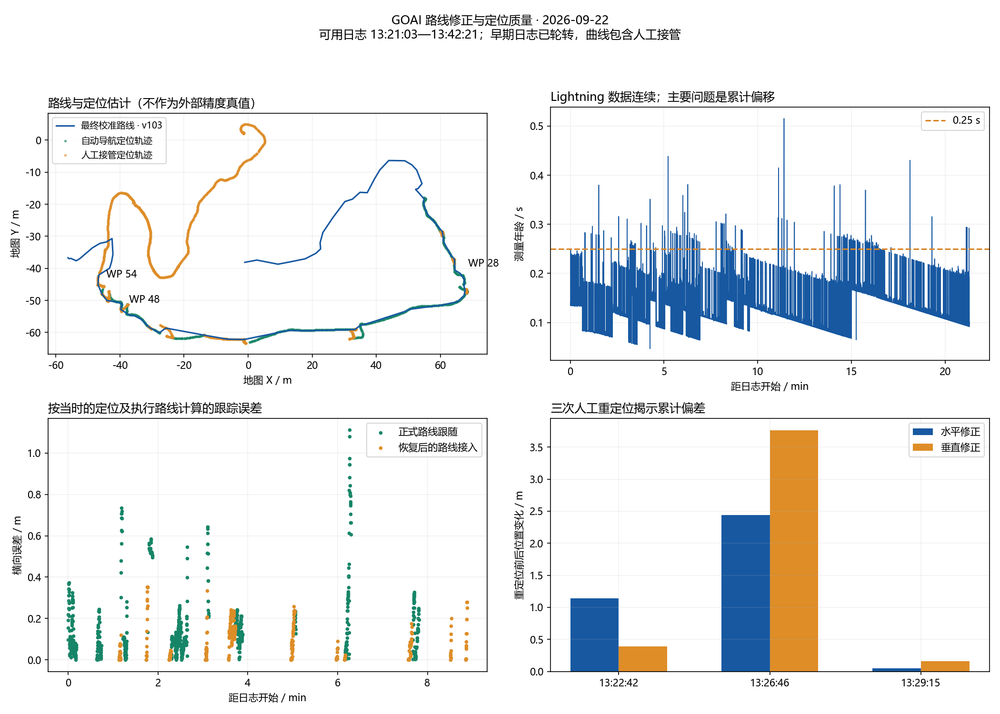

# GOAI 导航系统实现方案与技术报告

实现交付版 2026年9月26日

本报告说明 G12 导航 App 与 Orin 导航服务的完整实现，覆盖连续定位、后台地图修正、轨迹跟踪、运控策略、人工接管、路线编辑和部署复现。当前方案以 Lightning LIO 提供连续运动估计，以局部地图匹配修正累计漂移，由同一导航控制器生成速度指令，再通过单一运控网关执行。

系统已具备导航与人工控制的完整操作链路。最新自动地图修正版本通过 373 项 Orin 导航测试，并在真实静态点云和实际后台服务中验证。运动过程中的修正效果、楼梯跟踪和人工接管后恢复仍需要新版行走验收；不能将软件测试或静态残差解释为全程定位精度。

## 1 交付基线与适用范围

| 组成 | 交付版本或状态 |
|---|---|
| Orin 导航主服务 | 1.33-auto-map |
| G12 Android App | 1.22-offline-route，versionCode 22 |
| 运控网关 | 1.18-step-move |
| 当前里程计 | 前雷达 Lightning LIO |
| 正式室外路线快照 | 校准 103，66 路点，65 条边，12 校正点 |
| 路线预设快照 | 版本 7，实际使用基础普通、楼梯普通、高台 |
| 最近部署与在线证据 | 2026年9月22日 |
| 本次资料整理 | 2026年9月26日，本机归档与文档整理 |

交付包包含导航及 Android 源码、地图依赖资产、Lightning 运行时源码、已签名 APK、1.33 增量部署脚本、路线配置快照和验证记录。现有原厂底盘服务、ROS 环境、雷达驱动、waypoint 模型工作区和私有配对配置仍由 Orin 运行环境提供，因此本包不是空白设备整机镜像。

阅读顺序为系统架构、定位与控制实现、路线及策略、验证结果、部署与验收。报告中的“已验证”均限定到相应日期、数据和测试类型；本次没有重新连接机器人，也没有启动运动。

<!-- pagebreak -->

## 2 系统架构与数据通路



G12 负责显示和操作者输入，Orin 负责传感器处理、定位、路线跟踪及控制仲裁。自动导航与人工接管共用同一个运控出口，避免两个控制源同时驱动机器人。人工接管后，定位仍持续更新，后续恢复可以从当前位置重新接入剩余路线。[S1]

| 层次 | 主要模块 | 输入与输出 |
|---|---|---|
| 交互 | MainActivity、RouteDisplayCache | 地图、实体摇杆、操作请求、路线目录 |
| 估计 | Lightning、ContinuousPose | 点云与 IMU → 机体位姿、实测时间、地图对齐 |
| 地图修正 | Worker、AutomaticMatcher | 局部点云与地图 → 异步几何观测 |
| 导航 | Planning、Navigator、PosePID | 路线与位姿 → vx、vy、wz |
| 仲裁执行 | Mission、Gateway、Backend | 自动或人工输入 → 原厂或 waypoint 控制 |

App 的默认服务地址为 `10.21.33.102:18894`；内部网关为 `127.0.0.1:18895`。ROS 内部继续发布 `/wym/g12/localization` 和 `/wym/g12/navigation`；Lightning 使用专用 `/wym/navigation/lightning/*` 通道。USB 与 G12 SSH 中继用于运维，App 正常控制经机器人 Wi-Fi 直接连接 Orin。

后台地图匹配不阻塞导航循环。地图结果不足时保留连续里程计，不因一次匹配失败增加导航确认或速度限制。局部里程计重启则建立新的 epoch，防止旧结果混入新坐标系。

<!-- pagebreak -->

## 3 连续里程计与坐标时间约定

### 3.1 Lightning 接入

前 AIRY 点云和原始 IMU 经适配器输入 Lightning。适配保留原始消息时间戳及点内相对时间，将点内 float64 秒转换为算法所需的 float32 秒，算法内部仍按既有实现转为毫秒。本次集成没有重写 Lightning C++ 估计内核，也没有加入大加速度或大角速度整段拒绝规则。[S2]

Lightning 输出的 IMU 系位姿通过完整安装外参转换为机体系，包含安装旋转和位置偏置。约定 T_A_B 将 B 系坐标变换至 A 系，计算关系为：

```text
T_world_body = T_world_imu * inverse(T_body_imu)
T_map_body   = T_map_odom * T_odom_body
```

机体速度坐标为 X 向前、Y 向左、Z 向上，角速度单位 rad/s。适配器由连续实测位姿计算运动，不使用旧验证节点中默认填零的 twist。保存的 `contract.json` 中 `body_calibration_verified=false`，表示尚无独立机体外参标定验收；转换等价性测试不能替代物理外参精度验证。

### 3.2 时间与观测来源

导航将传感器时间映射至共享单调时钟，保留测量时刻与消息到达时刻。地图观测按自身测量时间关联历史里程计，再求取地图对齐，避免把已经移动后的当前位置直接与旧扫描混配。

连续定位区分实际测量、短期预测和可用性。现有雷达短期预测主要覆盖观测年龄大于 0.25 秒至 0.45 秒的窗口；预测不改写实测时间，不作为实际到点证据。普通 0.13–0.19 秒观测年龄仍主要使用最近测得的位姿，尚未普遍外推到控制时刻。[S3]

### 3.3 重启与人工重定位

Lightning 算法和适配器成组管理，重启生成新 epoch。人工重定位通过操作者给出的附近搜索区域求解几何匹配，不把点选坐标直接赋给机器人。成功后更新地图到里程计的对齐，并清除旧自动修正候选；异步迟到观测不能覆盖新对齐。

原先导航前端在 Lightning 启用后继续提供障碍感知，不再并行运行旧 GICP 主里程计。局部里程计的新鲜度与地图观测质量分别处理；地图失配不等同于局部运动估计失效。

<!-- pagebreak -->

## 4 后台自动地图修正

### 4.1 局部匹配与融合

初始地图对齐完成后，匹配进程每秒尝试一次局部搜索，前后雷达交替取样，以当前连续位姿及短时实测运动作为初值。点云使用既有外参、时间对齐和运动去畸变；不使用 waypoint 坐标充当定位观测，也不进行全地图盲检索。[S3]

每次匹配得到测量时刻的地图机体位姿，再与同一时刻的历史里程计组合：

```text
candidate_map_odom = matched_map_body(t) * inverse(odom_body(t))
alpha = 1 - exp(-dt / 2.0)
```

连续几何观测通过短窗一致性检查后，更新目标地图变换。平滑围绕当前机器人位置进行，以 2 秒时间常数逐渐收敛；这可避免在离地图原点很远时，微小旋转修正产生不合理的大平移。自动修正不增加定位 generation，不重新接入路线，不重置进度和临时点。

### 4.2 当前参数

| 参数 | 值 | 用途 |
|---|---:|---|
| 尝试周期 | 1.0 s | 后台局部地图观测 |
| 平滑时间常数 | 2.0 s | 地图偏差渐进修正 |
| 最大观测年龄 | 2.5 s | 排除过旧异步地图结果 |
| 创新范围 | 3.0 m / 20° | 保持本地搜索有效范围 |
| 一致性范围 | 0.30 m / 3° | 两次地图变换相互印证 |
| 一致性时间窗 | 4.0 s | 聚合同一阶段的几何观测 |
| 较好匹配要求 | 重叠率 ≥ 0.65；中位残差 ≤ 0.16 m | 用于自动修正采纳 |

较好匹配还要求求解收敛及几何条件比不低于 1e-6。人工附近重定位采用更宽的可用标准：重叠率至少 0.35、中位残差不超过 0.35 m、条件比至少 1e-8，一次可用几何结果即可生效。以上自动采纳条件只决定是否使用一条地图观测，不作为运动许可门槛。[S3]

### 4.3 耗时与移动影响

只读实测中，暖缓存的核心匹配多数约 10–40 ms，首次地图缓存建立约 300 ms；第二轮最后 8 次核心匹配耗时中位数约 14.3 ms。这是匹配函数耗时，不含扫描采集、通信排队、点云转换和融合发布，不能当作端到端延迟。

地图按历史测量时刻对齐，降低异步搜索导致的空间错配。2 秒平滑作用于累计地图偏差，不是将全部实时运动延迟 2 秒。高速跟踪仍会受到里程计年龄影响，常态延迟补偿列为后续优化而非本版已实现能力。

<!-- pagebreak -->

## 5 轨迹规划与速度控制

### 5.1 连续参考轨迹

原路线、接入路线与临时路点共用连续 Hermite 轨迹和航向参考。相同策略下的中间路点记录通过，不逐点停车确认、不逐点清空 PID。终点使用连续收敛参考；策略切换按操作者要求保留约 0.5 秒原地暂停。[S4]

Navigator 当前默认巡航参考为 2.0 m/s，运行时可保存操作者设置。这个数值是轨迹前馈参考，不是输出上限，也不是机器人实际速度保证。轨迹、导航和 PID 没有再次按旧路线速度字段限幅；最终响应由所选原策略及底盘能力决定。

### 5.2 耦合 PID

位置误差、积分和微分均在地图平面计算，最后统一转为机体 vx、vy、wz。前进、横向校正和转向同时存在，不使用按角度阈值切换“先转向再前进”的控制阶段。

```text
u_map = v_feedforward + Kp * e + Ki * integral(e)
        + Kd * (reference_rate - measured_rate)
vx_body = cos(yaw) * ux_map + sin(yaw) * uy_map
vy_body = -sin(yaw) * ux_map + cos(yaw) * uy_map
wz_body = u_yaw
```

| 控制量 | X | Y | Yaw |
|---|---:|---:|---:|
| Kp | 0.90 | 0.90 | 1.10 |
| Ki | 0.08 | 0.08 | 0.03 |
| Kd | 0.22 | 0.22 | 0.35 |

积分为 2 秒有限时间窗，降低移动参考点持续累积沿程误差的问题；测量微分采用 0.12 秒低通时间常数。沿轨参考变化率按实测运动投影计算，避免延迟位姿暂时保持时重复加入前向速度增益。

1.33 将前后两帧真实里程计统一变换到当前地图对齐下再求微分。地图修正造成的位置变化因此不会被错误解释为机器人突然加速，减少 D 项冲击。该修复已有静止与真实运动软件用例，但实际行走中的超调改善仍需复测。

### 5.3 速度接口

自动导航使用原厂物理速度接口 `0x110002`，控制模式为 Mode=1。人工原厂策略使用比例摇杆接口 `0x100002`、Mode=0，三个方向的输入按 -1 至 1 传递。waypoint 模型使用相对路点输入，尚不是标定后的物理速度跟踪器，因此不放入自动速度闭环。

<!-- pagebreak -->

## 6 人工接管与路线进度

人工接管按钮进入策略选择及控制页面，实体摇杆自动生效，无额外启用按钮。自动导航中明显推杆可进入人工接管；松杆后仍保持人工，操作者明确点击恢复导航后才继续路线。人工控制不依赖地图定位放行。[S5]

### 6.1 恢复导航

暂停、接管或重定位后，控制器清理旧积分和航向参考，从当前位姿连接剩余路线中最近的未来目标。已经完成和自动接入跳过的点保留记录；人工明确指定的目标优先于最近点逻辑，避免恢复后追向身后的旧目标。

重定位改变地图对齐后，航向参考从新姿态初始化，避免旧参考继续驱动错误转向。删除或清空最后一个临时点也复用前向接入逻辑，恢复正式路线前方的目标。这些路径已经软件回归验证；现场效果仍受到定位和已校准路点质量影响。

### 6.2 手动进度与重新开始

设置当前进度时，所选点成为下一目标，之前的点统一标记为已完成，并保留“人工完成”的来源记录。进度操作只改变执行起点，不删除完整路线。重新选择或重新开始路线时，可以再次执行全程。

路线重规划作用于已有路线图，可排除指定边并选择目标，生成预览后应用。最近未来目标接入是连接已有路线的局部折线，并非完整自由空间避障规划器；本实现不等同于 Nav2 式通用局部规划系统。

### 6.3 临时点与点位校准

地图点选可追加、替换、修改或删除临时后续点。导航运行中更新后续轨迹，暂停或人工时只编辑队列；临时点完成后接回正式路线。人工实际经过的临时点可从待执行队列移除，重定位跳变不冒充已运动通过。

正式路线校准采用草稿与应用两阶段。记录或编辑点先修改草稿；点击暂停控制并应用校准后，正式几何和地图显示同步更新，保持暂停，再恢复导航。校准不是在保存草稿时就静默改变正在执行的正式路径。新增路线录制另有连续轨迹和策略记录，并由操作者手动标记路点；本次快照是校准原路线，没有新增全程录制路线。

新旧点不叠加显示。正式线、临时点、校正点与草稿分别表现；离线缓存仅保存路线目录与版本，不恢复位姿、导航进度或临时队列。缓存按服务地址和地图资产隔离，连接后用服务端目录覆盖。[S6]

<!-- pagebreak -->

## 7 运控策略与室外路线预设

启动或恢复导航默认进入路线预设。导航页手动选择原厂策略后，覆盖跨路点持续生效，直到恢复分段预设或再次启动导航；暂停本身保留覆盖。模式变化先约 0.5 秒零输入再切换，实际反馈及底盘拒绝原因进入状态与日志，不把请求已发送当成模式已生效。[S5]

| 策略 | 原厂编号或模型版本 | 当前用途 |
|---|---|---|
| 基础普通 | 0x1001 | 默认预设、导航覆盖、人工 |
| 楼梯普通 | 0x1003 | 默认预设、导航覆盖、人工 |
| 高台 | 0x1002 | 默认预设、导航覆盖、人工 |
| 踏步移动 | 0xF002 | 保留选择能力，当前正式预设不使用 |
| 基础敏捷与楼梯敏捷 | 0x3002 / 0x3003 | 导航覆盖、人工 |
| 低速与高速 waypoint | 40000 / 28600 | 人工相对路点控制 |
| 低速 v5 与高速 v2 | 45200 / 35400 | 人工相对路点控制 |

人工共 10 个选项。代码的官方预设允许集合仍包含踏步移动，这是此前增加该策略留下的能力；当前保存的预设 7 实际仅使用基础普通、楼梯普通、高台三种。本次整理不修改这一功能范围。

下表由保存的 65 条边合并连续同策略区间生成。边界为“从起点出发到终点”的边范围，不按路点名字中的数字推断索引。[S7]

| 连续边范围 | 使用策略 |
|---|---|
| B01 → B02 | 基础普通 |
| B02 → B11 | 楼梯普通 |
| B11 → WP28 | 基础普通 |
| WP28 → WP29，含中间标记点 | 楼梯普通 |
| WP29 → WP31，含中间标记点 | 高台 |
| WP31 → WP52 | 基础普通 |
| WP52 → WP53 | 高台 |
| WP53 → B32 路线终点 | 基础普通 |

该快照体现提前进入 B03 楼梯路段的策略，以及短台阶先楼梯、到 WP29 再切高台的例外。原 WP31–WP42 踏步移动已按后续要求改为基础普通；WP49–WP52、WP54 及之后也为基础普通。逐边边界、全部点名和坐标见包内两个 CSV。

<!-- pagebreak -->

## 8 感知与故障诊断设计

### 8.1 楼梯和高台的障碍处理

障碍证据位于机体系前向走廊，主要范围为 X 0.45–1.10 m、横向 ±0.55 m、相对机体高度 -0.15–1.20 m。楼梯及高台策略在完整局部点云中寻找具有宽度和纵向支撑的踏面或台面，再将其下方台阶立面归入可通行地形；竖直墙面或窄孤立回波不能单独构成支撑面。[S8]

该处理减少“要攀爬的台阶被当成障碍”的冲突，但仍是局部几何判别，不是完整语义地形理解或动态绕障规划。9 月 22 日自动阶段仍有约 24 秒障碍暂停，现有证据不足以判断这些暂停是否全部正确；报告没有将其解释为定位失效，也没有声称误报已全部消除。

### 8.2 反馈与故障恢复

运控链路保留原策略输入范围，区分反馈时间偏移、短期消息间断、真实无效反馈和底盘故障。历史反馈延迟不应永久锁存为 policy fault；恢复逻辑以当前故障和新反馈为依据，真实仍存在的底盘故障不能仅通过清除软件文字状态解决。

故障处理、策略实际状态、发送记录和反馈年龄由网关记录。停止、阻尼和起立保留不同含义；软件部署保持暂停，不自动触发运动。上述机制服务于实际控制状态一致性，不再增加摇杆启用、回中或额外定位确认步骤。

### 8.3 可复查的日志

| 日志或状态 | 主要用途 |
|---|---|
| navigation-trace.jsonl | 目标、进度、位姿时间、参考轨迹、PID 分量与输出 |
| actuation-trace.jsonl | 实际发送、反馈、策略切换和故障恢复 |
| automatic_map_observation | 匹配质量、采用或忽略原因、测量时刻与变换 |
| automatic-map-scans.bin | 去畸变点云、匹配初值、里程计与地图对齐 |
| Lightning 状态 | epoch、输入计数、观测年龄、适配拒绝原因 |

自动修正点云日志采用 32 MB × 4 文件轮转。逐次核心匹配耗时已经记录，完整“采集至控制执行”的分段延迟尚未统一埋点。后续比较应关联原始测量、控制生成、实际发送和机器人反馈，不能仅看 App 刷新是否流畅。

<!-- pagebreak -->

## 9 里程计选型的实测依据

2026 年 9 月 21 日 20:50–21:04 的同轮运动数据比较了原导航里程计、FAST-LIO2 与 Lightning。通过起终点静止原始点云的多初值 GICP 配准及留出扫描交叉检查，支持机器人返回起点附近：相对平移约 0.093 m、相对航向约 4.73°。该参照仅约束起终点，不是全程真值。[S9]

| 方案 | 终点三维位置偏差 | 高度偏差 | 三维姿态偏差 |
|---|---:|---:|---:|
| 原导航里程计 | 19.57 m | -9.35 m | 24.23° |
| FAST-LIO2 当次配置 | 17.76 m | -10.72 m | 31.87° |
| Lightning 当次配置 | 1.71 m | -0.03 m | 5.48° |


Lightning 在本轮配置下闭合明显更好，因此成为当前主里程计。FAST-LIO2 在约 21:01:32 的窗口还出现与前向控制及速度反馈相背离的位移。由于没有完整滤波器内部状态，不能据此判定 FAST-LIO2 算法普遍较差，也不能把异常简单归因于通信延迟。

本轮主要为人工运动，没有有效自动路线跟踪过程。5,794 条人工指令可与发送记录一一关联，三个轴数值一致，只能支持转发链路未改写方向，不能证明楼梯自动导航方向或 PID 超调已经解决。FAST-LIVO2 未进入本次生产链路；当前交付也不是三个算法的融合系统。

<!-- pagebreak -->

## 10 最新路线与定位质量

9 月 22 日可用导航日志覆盖 13:21:03–13:42:21，共 25,518 个采样。此前日志已经轮转，不能完整评估前半段楼梯。[S10]

| 指标 | 结果 | 解释边界 |
|---|---:|---|
| Lightning 观测年龄中位数 / P95 | 0.128 / 0.194 s | 为导航所见数据年龄 |
| LOST 累计 | 0.104 s，2 个采样 | 未见持续局部丢失 |
| PREDICT_ONLY 累计 | 20.69 s | 不是实测到点证据 |
| 里程计 epoch | 全窗口同一值 | 未见估计器重启 |
| 末约 5 分钟净 XY / 航向变化 | 2.26 cm / 0.75° | 静止末段变化，不是绝对精度 |
| 两次较大人工对齐变化 | 水平 1.14 / 2.44 m | 表明仍有累计地图偏差 |
| WP28 / B22 / WP48 最大横向误差 | 0.73 / 0.75 / 1.11 m | 相对当时定位及执行路线 |

较大的三维对齐变化之一还包含约 3.76 m 高度变化。相邻发布位姿相隔约 50–64 ms，变化中包含实际运动，不能直接作为有外部真值的误差。按操作者要求，本次没有扩展上下楼层到点规则。

自动阶段 2,836 个采样中，正常跟随 1,464、路线接入 649、障碍暂停 489、策略切换暂停 165、等待策略反馈 60、短时缺前向感知 9；没有观察到自动阶段因地图关联失败而暂停。

当前正式路线 66 个有序路点、65 条边和 12 个校正点，没有重复点 ID 或非法坐标。校准 64 至 103 共更新 21 个点。坐标变化不等于校准误差；若在里程计漂移期间记录点位，偏差也可能写入路线。不能自动把操作者坐标改回旧版，应在可靠定位下优先复核 WP28、B22、WP48 及接管恢复区段。

在 2 m/s 下，0.128–0.194 秒测量年龄对应约 0.26–0.39 m 的运动距离，说明常态延迟补偿具有价值。这是按速度乘时间的量级估算，不是实测跟踪误差，也不包括底盘响应延迟。

<!-- pagebreak -->

## 11 验证结果与证据等级



| 验证 | 已取得证据 | 不能替代的验证 |
|---|---|---|
| Orin 完整导航回归 | 373 项通过，32.356 s | 真实机器人行走 |
| Lightning 适配回放 | 6,659 帧转换等价，无额外丢弃 | 算法真实定位精度 |
| APK 离线缓存 | 12 项检查通过，原签名覆盖安装 | 所有现场触控流程 |
| 两轮只读点云匹配 | 30 次中 18 次、32 次中 28 次几何可用 | 动态修正闭环 |
| 1.33 实际后台修正 | 采用 8 次，进度 54、校准 103 保留 | 运动中的稳定性与跟踪 |

最后一项验证期间服务保持暂停、网关未启用、输出为零；Lightning 与网关未重启。第二轮最后 8 次匹配相对修正中位数约 0.072 m，但两轮之间主服务定位已更新，不能宣称同一漂移从 2.4 m 降到 7 cm，更不能把残差当成绝对定位精度。[S11]

图中轨迹与横向误差由系统自身定位计算，人工运动区段不作为自动路线跟踪效果评价。自动地图修正的新版行走验证仍未完成。

<!-- pagebreak -->

## 12 部署复现与交付结构

已有部署的一键启动入口保持不变：

```bash
bash /home/wym/s10_navigation_app_v1/start_all.sh
```

它恢复 G12 回程路由，启动传感器，再启动或复用 Lightning、导航和运控网关。冷启动默认选择完整室外路线；不自动起立或启动导航。G12 默认访问 `http://10.21.33.102:18894`。

| 包内目录 | 使用方式 |
|---|---|
| source/slam | 导航、网关、Android 与冻结地图依赖源码 |
| source/lightning | 按归档源码重建独立 Lightning 运行时 |
| release/android | 安装已签名 1.22 APK |
| release/orin-auto-map-1.33 | 已有兼容基线的导航增量升级 |
| config-snapshot | 校准与预设参考，不默认覆盖现场配置 |
| evidence | 按日期分类的测试、部署与分析结果 |
| docs 与 tools | 部署指南、模块索引、完整性校验和分析程序 |

已有 1.32 环境升级时，先校验包，再进入增量目录运行 `python3 deploy_auto_map.py` 执行隔离测试。完成暂停后使用 `--deploy` 应用。脚本保留当前路线、进度和临时队列，仅重启导航主进程；更老版本不能未经比较直接覆盖。部署过程异常有自动回退，不提供通用手动 rollback 参数。[S12]

包内地图和三个导航依赖工程保持并列结构。Lightning 源码及许可证保留，已用上游提交为 `907ecebf118fbaed0ca7765822f9dfff1a13fd80`。Orin 原厂驱动、ROS、Python 环境及 `/home/wym/s10_g12_damping_ws` 中的模型和执行器仍是外部依赖。报告不将源码包描述为免依赖安装包。

APK 离线种子对应校准 64，联网后更新为服务端当前目录；正式路线快照为校准 103。部署不把快照覆盖到 Orin，也不恢复历史 target=54。原认证密钥和签名私钥不包含在包中；已签名 APK 可保留数据覆盖安装。

<!-- pagebreak -->

## 13 后续验收与优化顺序

优先验证运动中自动修正和接管恢复，再优化常态观测延迟。新一轮测试应保留同一轮导航、执行和传感器证据，先确认坐标和实际运动关系，再判断 PID 参数是否需要调整。

| 场景 | 重点检查 | 证据要求 |
|---|---|---|
| 平地直行和弯道 | 速度利用、横向误差、输出方向 | 位姿时间、PID 分量、实际速度 |
| B03–B11 楼梯 | B05/B06 侧偏、姿态、楼梯策略实际生效 | 策略反馈、位姿、现场轨迹 |
| WP29 高台与后续平地 | 策略边界及台面障碍误报 | 地形点云、暂停原因、模式记录 |
| 人工偏离后恢复 | 选择前方目标，不追回旧目标 | 接管前后进度、接入轨迹与输出 |
| 运动中地图修正 | 修正连续、D 项无假速度冲击 | 地图观测、对齐变换、实测微分 |
| 校准与临时点 | 显示和实际执行一致 | 目录版本、草稿应用、队列变更 |

对于定位精度，建议使用独立测量或可靠静态点云参照；没有全程真值时只报告闭合偏差、局部残差和系统自估横向误差。不能把 Lightning 当成另一个算法的全程真值。

下一项实现建议为控制时刻位姿外推：依据已测 LIO 运动及 IMU，将正常年龄的控制位姿推进至当前时刻，同时保留原始 measurement_pose、measurement_mono 和到点证据。这需要专门覆盖匀速、急转、暂停、重定位和掉帧测试；当前版本尚未实施。

之后补齐统一扫描 ID 与端到端时延分段日志，改进实际消费输入与录制输入的一致性。FAST-LIO2 保留问题窗口回放和参数分析用途；FAST-LIVO2 尚需独立视觉输入、标定与算力验证，不作为当前交付依赖。

当前实现解决了交互、控制仲裁、路线管理和定位接入的整合问题，并建立了真实时间对齐的后台地图修正。其工程可用性已有软件与静态实机证据；动态导航精度仍以接下来的行走验收为准。

<!-- pagebreak -->

## 14 证据与源码索引

下列路径相对交付包根目录。“同目录”均指 S1 的导航 App 源码目录。源码中的历史说明保留原版本语境；当前功能与参数以核对的源代码、配置快照和部署记录为准。

| 编号 | 文件或位置 |
|---|---|
| S1 | source/slam/g12_navigation_app_v1/runtime.py、mission.py、paths.py |
| S2 | 同目录 lightning/、lightning_odometry.py、odometry.json |
| S3 | 同目录 continuous_pose.py、automatic_localization.py、auto_localization.json、localization_quality.py |
| S4 | 同目录 trajectory.py、pose_pid.py、navigation.py |
| S5 | 同目录 planning.py、mission.py、backend/core.py、backend/hardware.py |
| S6 | 同目录 route_calibration.py、temporary_waypoints.py、route_recording.py、Android 源码 |
| S7 | config-snapshot/presets.json、route-calibration.json、full-route-segments.csv |
| S8 | 同目录 obstacle_evidence.py、backend/policy_recovery.py |
| S9 | evidence/lio-comparison-20260921/分析报告.md 及各项 JSON |
| S10 | evidence/localization-20260922/analysis.json、检查报告.md |
| S11 | evidence/auto-map-20260922/validation.log、deployment.json、live-verification.json |
| S12 | release/orin-auto-map-1.33/deploy_auto_map.py；docs/部署与复现.md |

完整包逐文件大小与 SHA-256 记录于 `PACKAGE_MANIFEST.json`，归档文件另附 SHA-256 校验值。`tools/verify_delivery.py` 只读验证包内文件，不访问机器人、不发运动指令。

大体积原始记录仍保存在本机原归档目录，其定位及校验索引为 `evidence/raw-archive-index.json`。本交付包包含关键分析结果和部署证据，不重复放入全部采集数据。历史分析脚本保留在 `tools/analysis`，完整重算需要按该索引准备原始输入。

术语约定：ODOM_BRIDGE 表示使用已对齐的连续里程计，不等同于定位丢失；PREDICT_ONLY 是短期预测；matching residual 是局部几何残差，不等同于全程绝对定位误差；cruise_mps 是参考速度，不等同于物理速度上限。
